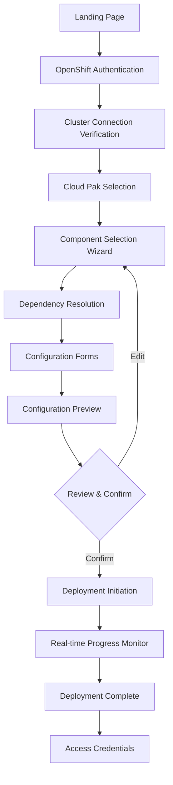

# Cloud Pak Deployer UI - Detailed Technical Specifications

This document provides detailed technical specifications for the Cloud Pak Deployer UI implementation.

## Table of Contents

1. [User Flows & Wireframes](#1-user-flows--wireframes)
2. [Component Specifications](#2-component-specifications)
3. [Data Models](#3-data-models)
4. [API Integration](#4-api-integration)
5. [Dependency Resolution](#5-dependency-resolution)
6. [Configuration Management](#6-configuration-management)

---

## 1. User Flows & Wireframes

### 1.1 Complete User Journey



### 1.2 Flow 1: Authentication & Cluster Connection

**Steps:**
1. User lands on welcome screen with IBM branding
2. User enters OpenShift login command
3. System validates command format (must start with "oc login")
4. System calls `POST /api/v1/oc-login`
5. System verifies connection with `GET /api/v1/oc-check-connection`
6. On success, user proceeds to component selection
7. On failure, clear error message with retry option

**UI Components:**
- Welcome screen with project description
- Login form with command input (TextInput)
- Connection status indicator (InlineLoading)
- Error notification (InlineNotification)
- Help text with example commands

**Wireframe:**
```
┌────────────────────────────────────────────────────────┐
│  IBM Cloud Pak Deployer                    [?] [User]  │
├────────────────────────────────────────────────────────┤
│                                                         │
│         Welcome to Cloud Pak Deployer                   │
│                                                         │
│  Deploy IBM Cloud Pak for Data, Integration, and       │
│  Business Automation on your OpenShift cluster          │
│                                                         │
│  ┌───────────────────────────────────────────────────┐ │
│  │ OpenShift Login Command                           │ │
│  │ ┌───────────────────────────────────────────────┐ │ │
│  │ │ oc login https://api.cluster.com:6443 --token │ │ │
│  │ └───────────────────────────────────────────────┘ │ │
│  │                                                   │ │
│  │ Example:                                          │ │
│  │ oc login https://api.cluster.com:6443 --token=... │ │
│  │                                                   │ │
│  │              [Connect to Cluster]                 │ │
│  └───────────────────────────────────────────────────┘ │
│                                                         │
└────────────────────────────────────────────────────────┘
```

### 1.3 Flow 2: Component Selection with Dependency Resolution

**Steps:**
1. User views Cloud Pak for Data component catalog
2. Components displayed as cards with name, description, category
3. User can search and filter by category
4. User selects a component (e.g., "Watson Machine Learning")
5. System analyzes dependencies from YAML
6. System auto-selects required dependencies
7. Auto-selected components marked with blue badge
8. System displays dependency tree visualization
9. User can click "Why?" to see dependency explanation
10. System checks for conflicts in real-time
11. If conflict detected, show warning modal
12. User continues selecting components
13. Dependency graph updates in real-time

**UI Components:**
- Search bar (Search)
- Category filter (Dropdown)
- Component cards (Tile with Checkbox)
- Auto-selected badge (Tag)
- Dependency tree (ForceGraph2D or Tree visualization)
- Conflict warning (Modal)
- Dependency explanation (Tooltip/Modal)
- Selected count indicator
- Continue button

**Wireframe:**
```
┌────────────────────────────────────────────────────────────────┐
│  IBM Cloud Pak Deployer              [Search...] [Filter ▼]    │
├────────────────────────────────────────────────────────────────┤
│                                                                 │
│  Select Components for Cloud Pak for Data                       │
│  Selected: 5 components (3 auto-selected)                       │
│                                                                 │
│  ┌──────────────┐  ┌──────────────┐  ┌──────────────┐         │
│  │ Watson ML    │  │ Watson Studio│  │ Watson       │         │
│  │ [✓] Selected │  │ [✓] Auto     │  │ OpenScale    │         │
│  │              │  │              │  │ [ ] Select   │         │
│  │ Machine      │  │ Data science │  │ AI model     │         │
│  │ learning     │  │ platform     │  │ monitoring   │         │
│  │              │  │              │  │              │         │
│  │ [Why?] [i]   │  │ [Why?] [i]   │  │ [i]          │         │
│  └──────────────┘  └──────────────┘  └──────────────┘         │
│                                                                 │
│  Dependency Visualization:                                      │
│  ┌──────────────────────────────────────────────────────────┐  │
│  │                                                          │  │
│  │    Watson ML ──requires──> Watson Studio                │  │
│  │         │                       │                        │  │
│  │         └──auto-installs──> Common Core Services        │  │
│  │                                                          │  │
│  └──────────────────────────────────────────────────────────┘  │
│                                                                 │
│                                    [Continue to Configuration] │
└────────────────────────────────────────────────────────────────┘
```

### 1.4 Flow 3: Configuration Management

**Steps:**
1. User reviews selected components in accordion
2. Each component has expandable configuration section
3. Forms are dynamically generated based on component schema
4. Required fields marked with asterisk
5. Real-time validation with error messages
6. User can preview generated config.yaml in side panel
7. User can save configuration with custom name
8. User can load previously saved configurations
9. User can export configuration as YAML file
10. User can import configuration from file

**UI Components:**
- Accordion for component sections
- Dynamic form fields (TextInput, Select, NumberInput, Toggle)
- Validation error messages (FormLabel with error state)
- YAML preview panel (CodeSnippet)
- Save/Load buttons (Button)
- Export/Import buttons (Button with Upload icon)
- Configuration name input (TextInput)

**Wireframe:**
```
┌────────────────────────────────────────────────────────────────┐
│  Configuration                                    [Save] [Load] │
├────────────────────────────────────────────────────────────────┤
│                                                                 │
│  ▼ Watson Machine Learning                                      │
│  ├─ Size: [Small ▼]                                            │
│  ├─ Storage Class: [managed-nfs-storage        ]               │
│  ├─ GPU Support: [✓] Enabled                                   │
│  └─ Replicas: [2]                                              │
│                                                                 │
│  ▼ Watson Studio                                                │
│  ├─ Size: [Medium ▼]                                           │
│  └─ Storage Size (GB): [100]                                   │
│                                                                 │
│  ▶ Common Core Services (auto-configured)                      │
│                                                                 │
│  ┌─────────────────────────────────────────────────────────┐   │
│  │ Preview: config.yaml                                    │   │
│  │ ─────────────────────────────────────────────────────── │   │
│  │ cp4d:                                                   │   │
│  │ - project: cpd                                          │   │
│  │   cartridges:                                           │   │
│  │   - name: wml                                           │   │
│  │     state: installed                                    │   │
│  │     size: small                                         │   │
│  └─────────────────────────────────────────────────────────┘   │
│                                                                 │
│                                    [Back] [Deploy]              │
└────────────────────────────────────────────────────────────────┘
```

### 1.5 Flow 4: Deployment & Monitoring

**Steps:**
1. User reviews final configuration summary
2. User clicks "Deploy" button
3. Confirmation modal shows deployment details
4. User confirms deployment
5. System calls `POST /api/v1/deploy`
6. System opens WebSocket connection to deployer pod
7. Progress indicator shows current stage
8. Progress bar shows percentage completion
9. Real-time logs stream to log viewer
10. User can filter logs by level (info, warning, error)
11. User can expand/collapse log sections
12. User can pause/cancel deployment (with confirmation)
13. On completion, success modal shows credentials
14. User can download logs as ZIP file
15. User can copy credentials to clipboard

**UI Components:**
- Deployment summary (Modal)
- Progress indicator with stages (ProgressIndicator)
- Progress bar (ProgressBar)
- Log viewer with filtering (DataTable or custom component)
- Pause/Cancel buttons (Button)
- Success modal with credentials (Modal)
- Copy to clipboard button (Button with Copy icon)
- Download logs button (Button with Download icon)

**Wireframe:**
```
┌────────────────────────────────────────────────────────────────┐
│  Deployment in Progress                    [Pause] [Cancel]     │
├────────────────────────────────────────────────────────────────┤
│                                                                 │
│  ● Validate ──● Prepare ──● Provision ──○ Configure ──○ Deploy │
│                                                                 │
│  Progress: 45% Complete                                         │
│  ████████████████░░░░░░░░░░░░░░░░░░░░░░░░░░░░░░░░░░░░░░░░░░   │
│                                                                 │
│  Current Stage: Provisioning Infrastructure                     │
│  Last Step: Creating storage classes                            │
│                                                                 │
│  ┌─────────────────────────────────────────────────────────┐   │
│  │ Deployment Logs                    [Filter ▼] [Search]  │   │
│  │ ─────────────────────────────────────────────────────── │   │
│  │ [INFO] Starting deployment process...                   │   │
│  │ [INFO] Validating configuration...                      │   │
│  │ [INFO] Configuration valid                              │   │
│  │ [INFO] Preparing environment...                         │   │
│  │ [INFO] Creating storage classes...                      │   │
│  │ [INFO] Storage class 'managed-nfs-storage' created      │   │
│  │ ▼                                                       │   │
│  └─────────────────────────────────────────────────────────┘   │
│                                                                 │
└────────────────────────────────────────────────────────────────┘
```

---

## 2. Component Specifications

### 2.1 ComponentCard Component

```typescript
// components/common/ComponentCard.tsx
import React from 'react';
import { Tile, Checkbox, Button, Tag } from '@carbon/react';
import { Information } from '@carbon/icons-react';

interface ComponentCardProps {
  component: Component;
  isSelected: boolean;
  isAutoSelected: boolean;
  onSelect: () => void;
  onDeselect: () => void;
  onShowInfo: () => void;
}

export const ComponentCard: React.FC<ComponentCardProps> = ({
  component,
  isSelected,
  isAutoSelected,
  onSelect,
  onDeselect,
  onShowInfo
}) => {
  return (
    <Tile className="component-card">
      <div className="card-header">
        <h4>{component.name}</h4>
        {isAutoSelected && (
          <Tag type="blue" size="sm">Auto-selected</Tag>
        )}
        {component.category && (
          <Tag type="gray" size="sm">{component.category}</Tag>
        )}
      </div>
      
      <p className="card-description">{component.description}</p>
      
      {component.restrictions.length > 0 && (
        <div className="card-restrictions">
          <Tag type="red" size="sm">Has restrictions</Tag>
        </div>
      )}
      
      <div className="card-footer">
        <Checkbox
          id={`select-${component.id}`}
          labelText="Select"
          checked={isSelected}
          onChange={isSelected ? onDeselect : onSelect}
          disabled={isAutoSelected}
        />
        <Button
          kind="ghost"
          size="sm"
          renderIcon={Information}
          onClick={onShowInfo}
          iconDescription="View dependencies"
        >
          Dependencies
        </Button>
      </div>
    </Tile>
  );
};
```

### 2.2 DependencyGraph Component

```typescript
// components/visualizations/DependencyGraph.tsx
import React, { useMemo } from 'react';
import { ForceGraph2D } from 'react-force-graph';

interface DependencyGraphProps {
  graph: DependencyGraph;
  selectedComponents: Set<string>;
  onNodeClick?: (node: DependencyNode) => void;
}

export const DependencyGraph: React.FC<DependencyGraphProps> = ({
  graph,
  selectedComponents,
  onNodeClick
}) => {
  const graphData = useMemo(() => {
    return {
      nodes: graph.nodes.map(node => ({
        id: node.id,
        name: node.name,
        val: selectedComponents.has(node.id) ? 10 : 5,
        color: getNodeColor(node, selectedComponents)
      })),
      links: graph.edges.map(edge => ({
        source: edge.source,
        target: edge.target,
        label: edge.type,
        color: edge.type === 'requires' ? '#0f62fe' : '#8d8d8d'
      }))
    };
  }, [graph, selectedComponents]);
  
  const getNodeColor = (node: DependencyNode, selected: Set<string>) => {
    if (selected.has(node.id)) {
      return node.autoSelected ? '#0043ce' : '#0f62fe'; // IBM Blue
    }
    return '#e0e0e0'; // Gray
  };
  
  return (
    <div className="dependency-graph">
      <ForceGraph2D
        graphData={graphData}
        nodeLabel="name"
        nodeColor="color"
        linkColor="color"
        linkDirectionalArrowLength={3.5}
        linkDirectionalArrowRelPos={1}
        linkLabel="label"
        onNodeClick={onNodeClick}
        width={800}
        height={600}
      />
      <div className="graph-legend">
        <div className="legend-item">
          <span className="legend-color" style={{ background: '#0f62fe' }} />
          <span>User Selected</span>
        </div>
        <div className="legend-item">
          <span className="legend-color" style={{ background: '#0043ce' }} />
          <span>Auto-selected</span>
        </div>
        <div className="legend-item">
          <span className="legend-color" style={{ background: '#e0e0e0' }} />
          <span>Not Selected</span>
        </div>
      </div>
    </div>
  );
};
```

### 2.3 DynamicForm Component

```typescript
// components/forms/DynamicForm.tsx
import React from 'react';
import { useForm, Controller } from 'react-hook-form';
import { zodResolver } from '@hookform/resolvers/zod';
import {
  Form,
  TextInput,
  Select,
  SelectItem,
  NumberInput,
  Toggle,
  FormLabel
} from '@carbon/react';

interface DynamicFormProps {
  schema: FormSchema;
  values: Record<string, any>;
  onChange: (values: Record<string, any>) => void;
}

export const DynamicForm: React.FC<DynamicFormProps> = ({
  schema,
  values,
  onChange
}) => {
  const {
    control,
    handleSubmit,
    formState: { errors }
  } = useForm({
    defaultValues: values,
    resolver: zodResolver(schema.zodSchema)
  });
  
  const renderField = (field: FormField) => {
    switch (field.type) {
      case 'text':
        return (
          <Controller
            name={field.name}
            control={control}
            render={({ field: { onChange, value } }) => (
              <TextInput
                id={field.name}
                labelText={field.label}
                placeholder={field.placeholder}
                value={value}
                onChange={(e) => onChange(e.target.value)}
                invalid={!!errors[field.name]}
                invalidText={errors[field.name]?.message as string}
                helperText={field.helperText}
              />
            )}
          />
        );
      
      case 'select':
        return (
          <Controller
            name={field.name}
            control={control}
            render={({ field: { onChange, value } }) => (
              <Select
                id={field.name}
                labelText={field.label}
                value={value}
                onChange={(e) => onChange(e.target.value)}
                invalid={!!errors[field.name]}
                invalidText={errors[field.name]?.message as string}
              >
                {field.options?.map(option => (
                  <SelectItem
                    key={option.value}
                    value={option.value}
                    text={option.label}
                  />
                ))}
              </Select>
            )}
          />
        );
      
      case 'number':
        return (
          <Controller
            name={field.name}
            control={control}
            render={({ field: { onChange, value } }) => (
              <NumberInput
                id={field.name}
                label={field.label}
                value={value}
                onChange={(e, { value }) => onChange(value)}
                min={field.min}
                max={field.max}
                step={field.step}
                invalid={!!errors[field.name]}
                invalidText={errors[field.name]?.message as string}
              />
            )}
          />
        );
      
      case 'boolean':
        return (
          <Controller
            name={field.name}
            control={control}
            render={({ field: { onChange, value } }) => (
              <Toggle
                id={field.name}
                labelText={field.label}
                toggled={value}
                onToggle={onChange}
              />
            )}
          />
        );
      
      default:
        return null;
    }
  };
  
  return (
    <Form onSubmit={handleSubmit(onChange)}>
      {schema.fields.map(field => (
        <div key={field.name} className="form-field">
          {renderField(field)}
        </div>
      ))}
    </Form>
  );
};
```

---

## 3. Data Models

### 3.1 Core TypeScript Interfaces

```typescript
// types/component.types.ts

export interface Component {
  id: string;
  name: string;
  originalName: string;
  description: string;
  category: ComponentCategory;
  restrictions: string[];
  externalDependencies: ExternalDependency[];
  serviceDependencies: ServiceDependency[];
  componentDependencies: ComponentDependency[];
  configSchema: FormSchema;
  state: 'removed' | 'installed';
  version?: string;
  size?: 'small' | 'medium' | 'large';
}

export type ComponentCategory =
  | 'AI & Machine Learning'
  | 'Data Management'
  | 'Analytics'
  | 'Integration'
  | 'Governance'
  | 'Development Tools';

export interface ExternalDependency {
  name: string;
  type: 'operator' | 'platform_software' | 'external_system' | 'license' | 'client_software';
  installBehavior: 'must_exist' | 'auto_installed';
  notes?: string[];
  conditional?: boolean;
  condition?: string;
}

export interface ServiceDependency {
  name: string;
  type: 'service';
  relationship: 'required' | 'optional' | 'conditional';
  installBehavior?: 'auto_installed';
  condition?: string;
  notes?: string[];
}

export interface ComponentDependency {
  name: string;
  type: 'component';
  originalName: string;
  installBehavior: 'auto_installed';
  conditional?: boolean;
  condition?: string;
}

export interface DependencyGraph {
  nodes: DependencyNode[];
  edges: DependencyEdge[];
}

export interface DependencyNode {
  id: string;
  name: string;
  type: 'service' | 'component' | 'operator' | 'platform';
  selected: boolean;
  autoSelected: boolean;
  required: boolean;
}

export interface DependencyEdge {
  source: string;
  target: string;
  type: 'requires' | 'optional' | 'installs';
  conditional?: boolean;
  condition?: string;
}

export interface Conflict {
  component1: string;
  component2: string;
  reason: string;
  severity: 'error' | 'warning';
}

export interface FormSchema {
  fields: FormField[];
  zodSchema: any; // Zod schema for validation
}

export interface FormField {
  name: string;
  label: string;
  type: 'text' | 'select' | 'number' | 'boolean';
  required: boolean;
  placeholder?: string;
  helperText?: string;
  options?: Array<{ value: string; label: string }>;
  min?: number;
  max?: number;
  step?: number;
  defaultValue?: any;
}
```

### 3.2 Configuration Types

```typescript
// types/config.types.ts

export interface CloudPakConfig {
  global_config: GlobalConfig;
  openshift: OpenShiftConfig[];
  cp4d: CP4DConfig[];
}

export interface GlobalConfig {
  environment_name: string;
  cloud_platform: 'existing-ocp' | 'aws' | 'azure' | 'ibm-cloud' | 'vsphere';
  confirm_destroy: boolean;
  optimize_deploy: boolean;
  env_id: string;
}

export interface OpenShiftConfig {
  name: string;
  ocp_version: string;
  cluster_name: string;
  domain_name: string;
  mcg?: {
    install: boolean;
    storage_type?: string;
    storage_class?: string;
  };
  gpu?: {
    install: 'auto' | 'yes' | 'no';
  };
  openshift_ai?: {
    install: 'auto' | 'yes' | 'no';
    channel?: string;
  };
  openshift_storage?: Array<{
    storage_name: string;
    storage_type: string;
  }>;
}

export interface CP4DConfig {
  project: string;
  openshift_cluster_name: string;
  cp4d_version: string;
  cp4d_entitlement: string[];
  cp4d_production_license: boolean;
  accept_licenses: boolean;
  db2u_limited_privileges?: boolean;
  operators_project?: string;
  ibm_cert_manager?: boolean;
  install_day0_patch?: boolean;
  state: 'installed' | 'removed';
  cartridges: CartridgeConfig[];
}

export interface CartridgeConfig {
  name: string;
  description?: string;
  size?: 'small' | 'medium' | 'large';
  state: 'installed' | 'removed';
  installation_options?: Record<string, any>;
  instances?: InstanceConfig[];
  models?: ModelConfig[];
  replicas?: number;
  scale?: string;
}

export interface InstanceConfig {
  name: string;
  description?: string;
  size?: string;
  storage_class?: string;
  storage_size_gb?: number;
  metadata_size_gb?: number;
  data_size_gb?: number;
  backup_size_gb?: number;
  transactionlog_size_gb?: number;
}

export interface ModelConfig {
  model_id: string;
  state: 'installed' | 'removed';
  model_install_parameters?: {
    shards?: number;
    nodeSelector?: Record<string, string>;
  };
}
```

### 3.3 API Response Types

```typescript
// types/api.types.ts

export interface DeploymentStatus {
  deployer_active: boolean;
  deployer_stage?: DeploymentStage;
  last_step?: string;
  percentage_completed?: number;
  completion_state?: 'Successful' | 'Failed' | null;
  mirror_current_image?: string;
  mirror_number_images?: number;
  service_state?: string;
  cp4d_url?: string;
  cp4d_user?: string;
  cp4d_password?: string;
}

export type DeploymentStage =
  | 'validate'
  | 'prepare'
  | 'provision-infra'
  | 'configure-infra'
  | 'install-cloud-pak'
  | 'configure-cloud-pak'
  | 'deploy-assets'
  | 'smoke-tests';

export interface DeployRequest {
  envId: string;
  oc_login_command: string;
  entitlementKey: string;
  adminPassword?: string;
}

export interface DeployResponse {
  status: 'running' | 'started' | 'error';
  message?: string;
  job_name?: string;
}

export interface OCLoginResponse {
  code: number;
  error: string;
}

export interface LogEntry {
  timestamp: string;
  level: 'info' | 'warning' | 'error' | 'debug';
  message: string;
  source?: string;
}
```

---

*This document continues with API Integration, Dependency Resolution Algorithm, Configuration Management, Authentication & Security, Mock UI Implementation, Testing Strategy, and Deployment Pipeline in the next section.*